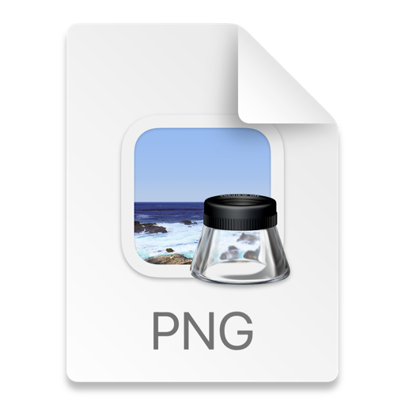

# dealer-purchase

Dealer Purchase(https://github.com/ostboiko/dealer-purchase)

Here you can create a dealer, a car and a factory

To start the server you need to run in the terminal:
"python manage.py runserver"

The beauty of the web application is that you can assign a car to a dealer, create dealer cars

When you go to the main page, the number of dealers, cars...

Project homepage:https://github.com/ostboiko/dealer-purchase
Pull Request:https://github.com/ostboiko/dealer-purchase/pull/1

If you'd like to contribute, please fork the repository and use a feature branch. Pull requests are warmly welcome.

